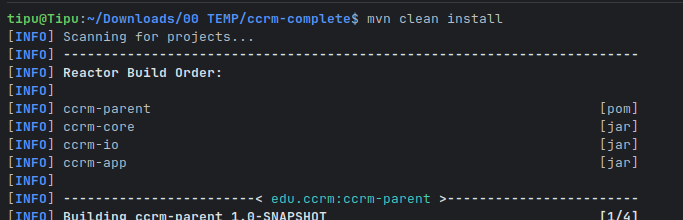

# Campus Course & Records Manager (CCRM)

## 📖 Overview
CCRM is a **Java 17 Maven multi-module project** with three submodules:
- **ccrm-core** → domain classes, datastore, services
- **ccrm-io** → import/export JSON/CSV, backup
- **ccrm-app** → CLI launcher and menu

The system manages students, courses, and enrollments using an in-memory datastore with import/export to JSON/CSV.  
Includes **demo mode** (option `9` in menu) that runs scripted inputs automatically from `data/demo-input.txt`.

---

## 🏗 Build & Run

### Requirements
- JDK 17+
- Apache Maven 3.8+
- IntelliJ IDEA or Eclipse (Maven support enabled)

### Commands bash
```
mvn clean install
mvn -pl ccrm-app exec:java -Dexec.mainClass="edu.ccrm.cli.Launcher"
```

### Demo Mode
```
Menu: 1-Students 2-Courses 3-Enrollment 4-IO 9-Demo 0-Exit
Choice: 9
```
Runs scripted commands from `data/demo-input.txt`.

---

## 📂 Project Structure (detailed)
```
ccrm-parent/
├── pom.xml
├── ccrm-core/
│   ├── domain/       # Student, Course, Enrollment, etc.
│   ├── datastore/    # In-memory DB
│   ├── service/      # Interfaces + impl
│   ├── exception/    # Custom exceptions
│   ├── util/         # IdGenerator, Validators
│   └── config/       # AppConfig (Singleton)
├── ccrm-io/
│   ├── ImportExportService.java
│   ├── BackupService.java
│   └── AppDirs.java
├── ccrm-app/
│   ├── CliMenu.java
│   ├── DemoRunner.java
│   └── Launcher.java
├── data/
│   ├── students.json
│   ├── courses.json
│   └── demo-input.txt
├── test-data/
│   ├── students.csv
│   └── courses.csv
└── output/
```

---

## 🕰 Evolution of Java
- **1995**: Java 1.0 – Write once, run anywhere
- **1998**: Java 2 (J2SE, J2EE, J2ME introduced)
- **2004**: Java 5 (Generics, Annotations, Enums)
- **2011**: Java 7 (NIO.2, try-with-resources)
- **2014**: Java 8 (Streams, Lambdas, Optional, Date/Time API)
- **2017**: Java 9 (Modules)
- **2019–2025**: Java 11, 17, 21 LTS – modern APIs, Records, Sealed Classes

---

## ☕ Java ME vs SE vs EE
| Edition | Purpose | Example Use Cases |
|---------|---------|------------------|
| **ME (Micro Edition)** | Lightweight, resource-constrained devices | Embedded systems, feature phones |
| **SE (Standard Edition)** | Core Java libraries + APIs | Desktop apps, CLI apps (like CCRM) |
| **EE (Enterprise Edition)** | Adds web, enterprise APIs | Servlets, JSP, Jakarta EE, enterprise backends |

---

## 🔑 JDK, JRE, JVM Explained
- **JVM** (Java Virtual Machine): Executes compiled bytecode.
- **JRE** (Java Runtime Environment): JVM + standard libraries to *run* Java apps.
- **JDK** (Java Development Kit): JRE + compiler + dev tools to *build* apps.

---

## 🖥 Install on Windows
1. Download **JDK 17** from [Oracle](https://www.oracle.com/java/technologies/downloads/).
2. Install and set environment variables:
    - `JAVA_HOME=C:\Program Files\Java\jdk-17`
    - Add `%JAVA_HOME%\bin` to `PATH`
3. Verify:
   ```
   java -version
   javac -version
   ```
4. Install **Eclipse IDE** → Add Maven plugin if not preinstalled.
5. Import project: *File → Import → Existing Maven Project → select ccrm-parent/pom.xml*

(*📸 Insert your screenshots here*)

---

## 📑 Mapping Syllabus → Implementation
| Syllabus Topic | Where in Project |
|----------------|------------------|
| OOP (Encapsulation, Inheritance, Polymorphism) | `domain/Student.java`, `domain/Instructor.java`, `domain/Course.java` |
| Abstraction (interfaces) | `service/StudentService.java`, `CourseService.java` |
| Packages | `edu.ccrm.domain`, `edu.ccrm.service`, etc. |
| Exception Handling | `exception/DuplicateEnrollmentException.java` |
| Collections Framework | `DataStore` uses `ConcurrentHashMap`, `List`, `Set` |
| Generics | Service methods with generics (`List<Student>`) |
| I/O (File, NIO.2) | `ImportExportService`, `BackupService` |
| Threads/Concurrency | `ConcurrentHashMap` in `DataStore` |
| Date/Time API | `Enrollment.java` uses `LocalDate` |
| Assertions | `Person.java` constructor (`assert id > 0`) |

---

## ⚙ Enabling Assertions
Enable with `-ea`:
```bash
java -ea -cp target/classes edu.ccrm.cli.Launcher
```

---

## 🎮 Usage (Quick Guide)
See **USAGE.md** for sample commands and data files.

---
## 🖥 Screen Shots
# 1. java installation verification


# 2. project set up and run ( run the commands as described above)

```
mvn clean install
mvn -pl ccrm-app exec:java
```

# 3. demo menu


# 4. project folders structure

---
